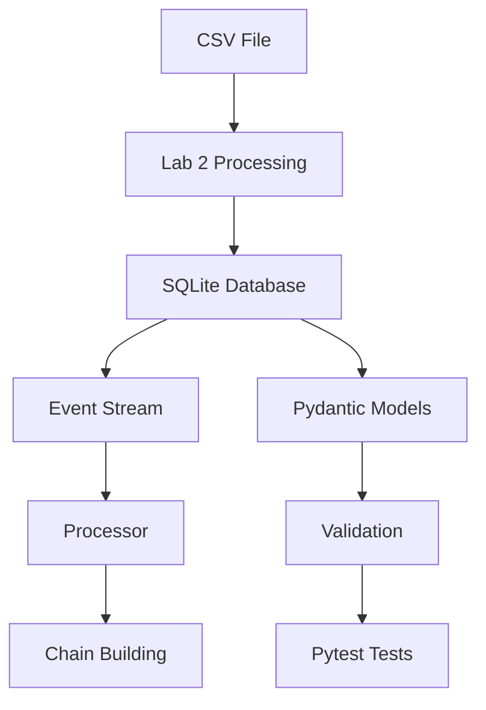

# BlockProcessor Project (Labs 2–6)

## Description

This project is a set of laboratory works where a simplified block processing system was implemented.

The system works with:

* blocks
* votes
* persons
* sources

Main idea: process blocks and votes, build a chain, and store all data in a SQLite database.

---

## Project Structure

```
project/
│
├── lab2.py              # CSV processing (initial logic)
├── db_init.py           # database creation (Lab 3)
├── models_sql.py        # classes with SQL queries (Lab 4)
├── processor.py         # event stream + chain logic (Lab 5)
├── models.py            # Pydantic models (Lab 6)
├── test_models.py       # pytest tests
├── lab3.db              # SQLite database
└── README.md
```

---

##  Functionality by Labs

###  Lab 2 – CSV Processing

* Reads data from `lab2.csv`
* Creates:

  * `Block`
  * `Vote`
* Builds a simple chain based on votes

---

###  Lab 3 – SQLite Database

Database `lab3.db` contains tables:

* `BLOCKS`
* `PERSONS`
* `SOURCES`
* `VOTES`
* `EVENT_STREAM`

---

###  Lab 4 – SQL + Classes

Classes:

* `Block`
* `Person`
* `Source`
* `Vote`

Features:

* select all records
* JOIN queries (votes with details)
* GROUP BY (votes per block)
* TOP voters

---

###  Lab 5 – Event Stream Processing

* Reads events from `EVENT_STREAM`
* Types:

  * `block`
  * `vote`
* Builds chain dynamically

---

###  Lab 6 – Validation and Testing

Used:

* `Pydantic` – for validation
* `Pytest` – for testing

Validation examples:

* `view >= 0`
* `id > 0`
* `country_code` must be 2 letters

---

##  Workflow (Mermaid Diagram)



---

##  Technologies

* Python
* SQLite
* Pydantic
* Pytest
* Markdown
* Mermaid

---

##  How to Run

1. Initialize database:

```
python db_init.py
```

2. Run processor:

```
python processor.py
```

3. Run tests:

```
pytest
```

---

##  Conclusion

In this project we implemented:

* OOP classes
* database integration
* event-driven processing
* validation with Pydantic
* automated testing

The project demonstrates basic backend architecture and data processing pipeline.
